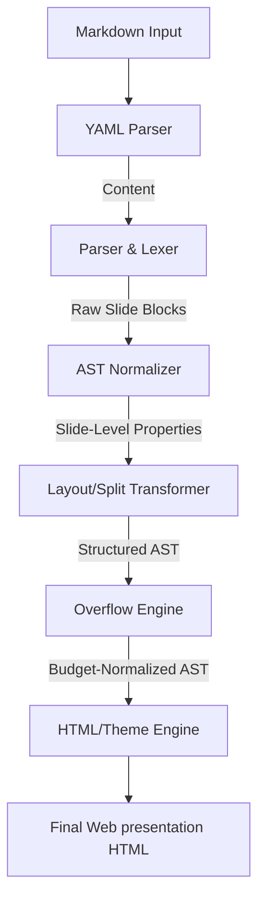

# @mindfiredigital/mdslide-core

The core compilation, normalization, and rendering engine for `mdslide`. It orchestrates the transformation of a parsed Markdown AST into interactive, styled slide decks.

## 🏗 Compiler Architecture & Pipeline Flow

The compilation process is managed by the central `Compiler` class and flows through the following pipeline:



---

## 📦 Key Core Modules

### 1. Parser & Lexer (`src/parser/`)

Translates raw Markdown source string into slide chunks. Slicing boundaries are detected using a three-phase boundary resolution model:

- **Phase 1 (Explicit Dividers)**: Identifies thematic breaks (`---`) or level-2 headings (`##`) to split slides.
- **Phase 2 (Heading Boundaries)**: If no explicit dividers exist, it splits the document at every major header level H1 (`#`) or H3 (`###`).
- **Phase 3 (Fallback Budget Chunking)**: If the document is flat text with no headers or dividers, it accumulates node layout weights until it crosses `MAX_SLIDE_SCORE` (100) and splits to maintain legibility.

### 2. Normalizer & Metadata Extractor (`src/normalizer/`)

Translates standard MDAST nodes into custom Slide AST representations. It parses and filters slide configurations declared in HTML comments:

- **Layout Overrides**: `<!-- layout: type -->` overrides layout classification (`title`, `bullets`, `code`, `visual`, `table`, `quote`, `statement`, `split`).
- **Background Images**: `<!-- backgroundImage: url('...') [dark|light] -->` mounts custom backgrounds.
- **Title Positioning**: `<!-- titleAlign: center -->` (horizontal alignment) and `<!-- titlePosition: bottom -->` (vertical alignment) are normalized and appended to slide data attributes.
- **Speaker Notes**: Text inside `<!-- notes -->...<!-- /notes -->` is extracted as slide notes.

### 3. Layout & Column Transformer (`src/transformers/`)

Handles advanced multi-column transformations:

- **Manual Splits (`::split::`)**: Locates the `::split::` separator block, groups nodes on the left and right, wraps them in column sub-containers, and applies the `split` layout.
- **Auto-Splits**: If a slide contains exactly one image alongside text, the engine automatically splits them into a two-column layout (text on left, image on right). If a slide contains only an image, it transforms it to a full-screen `visual` layout.

### 4. Visual Overflow Engine (`src/overflow/`)

To prevent contents from bleeding out of the viewport, the overflow engine calculates the vertical size of each node in pixels:

- **Height Heuristics**:
  - Code Block: `50px` header + `24px * number of lines`.
  - Table: `35px` header + `38px * number of rows`.
  - Bullet List Item: text wrapping count (evaluated at 55 chars per line) \* `30px` + `10px` margin.
  - Image: `350px`.
  - Paragraph: text wrap count (at 65 chars/line) \* `30px` + `15px`.
  - Headings: H1: wrap count _ `65px` + `20px`; H2/H3: wrap count _ `45px` + `15px`.
- **Splitting Rules**: If the total height exceeds `680px`, it splits lists and code blocks. Remaining items are pushed onto a new continuation slide, retaining the parent settings and appending `(Cont.)` to the title.

### 5. Theme Engine (`src/themes/`)

Injects styling systems:

- Resolves base styles (like 1080p slide margins, transitions, and docks) and integrates custom CSS variables for predefined themes (`light`, `dark`, `notion`, `terminal`, `gradient`, `corporate`, `solarized`).

---

## ✍️ Slide Syntax Quick Reference

### Frontmatter (Global)

```yaml
---
title: Presentation Title
theme: corporate
titleAlign: center
titlePosition: top
---
```

### Column Splitting (`::split::`)

```markdown
# Multi-Column Layout

Left column points:

- Bullet item 1
- Bullet item 2

::split::

Right column points:

- Bullet item 3
- Bullet item 4
```

### Overrides (Local Slide Comments)

```markdown
<!-- layout: quote -->
<!-- titleAlign: right -->
<!-- titlePosition: bottom -->
<!-- backgroundImage: url('background.png') dark -->

<!-- notes -->

Speaker notes for Presenter View console window.

<!-- /notes -->
```

---

## 🛠 Programmatic Usage

You can invoke the compiler programmatically by importing the `Compiler` class:

```typescript
import { Compiler } from '@mindfiredigital/mdslide-core';

const compiler = new Compiler();
const result = compiler.compile(
  `# Slide 1
Content
---
# Slide 2`,
  { theme: 'gradient' }
);

console.log(result.html); // Output standalone presentation HTML
console.log(result.slides); // Output normalized AST array
console.log(result.meta); // Output parsed frontmatter metadata
```
